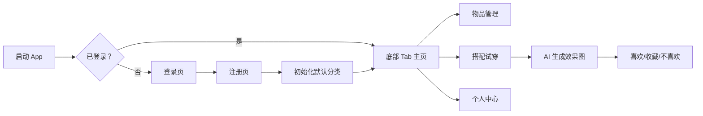

# 产品需求文档（PRD）：衣橱搭配助手 ClosetMate

## 1. 产品概述

衣橱搭配助手（ClosetMate）是一款面向注重穿搭效率用户的移动端 Web App，帮助用户数字化管理个人衣物、快速浏览分类并完成 AI 虚拟试穿搭配。

- **核心价值**：通过分类浏览解决“找不到衣服”的痛点；通过 AI 虚拟试穿解决“出门前搭配费时”的痛点。
- **目标用户**：时尚敏感度高的年轻女性/男性，日常穿搭决策频繁的人群。
- **平台形态**：移动端优先（适配 Android 手机），作为 Web App 运行，界面简洁清晰，支持双主题切换。

## 2. 核心功能

### 2.1 用户角色

| 角色 | 注册方式 | 核心权限 |
| :--- | :--- | :--- |
| 普通用户 | 手机号或邮箱 + 密码 | 管理个人物品、分类、搭配记录与个人资料 |

### 2.2 功能模块

1. **登录/注册**：支持手机号或邮箱注册，登录后进入主页。
2. **物品管理**：分类卡片流、分类管理、分类详情网格、物品新建/编辑/删除。
3. **搭配试穿**：按分类单选物品，校验上装/下装/鞋子必选后模拟 AI 生成试穿效果图，支持喜欢/收藏/不喜欢反馈。
4. **个人中心**：头像昵称展示、互动记录入口（喜欢/收藏/不喜欢）、编辑资料、主题切换、注销账号。

### 2.3 页面清单

| 页面名称 | 所属模块 | 功能描述 |
| :--- | :--- | :--- |
| 登录页 | 登录/注册 | 手机号/邮箱 Tab 切换登录 |
| 注册页 | 登录/注册 | 手机号/邮箱注册，自动初始化默认分类 |
| 物品主页 | 物品管理 | 分类卡片流，显示各分类物品数量 |
| 分类管理页 | 物品管理 | 增删自定义分类，默认分类不可删除 |
| 分类详情页 | 物品管理 | 网格展示该分类物品，支持新建/编辑/删除 |
| 新建/编辑物品弹窗 | 物品管理 | 上传照片、填写名称与价格 |
| 搭配选择页 | 搭配试穿 | 按分类单选物品，实时显示已选清单 |
| 搭配结果页 | 搭配试穿 | 展示 AI 生成图与反应按钮 |
| 个人中心页 | 个人中心 | 头像昵称、互动入口、设置菜单 |
| 互动记录页 | 个人中心 | 展示喜欢/收藏/不喜欢的搭配列表 |
| 编辑资料页 | 个人中心 | 修改头像、昵称、密码、性别 |

## 3. 核心流程

用户首次打开 App 进入登录页，无账号则进入注册页；注册成功后系统初始化默认分类（上装、下装、袜子、鞋子、发饰、耳饰、外套、背包）。登录后进入底部 Tab 框架，默认显示“物品”页。

在“物品”页可浏览分类、管理分类、进入分类详情新增衣物。在“搭配”页按分类单选物品，必须选中上装、下装、鞋子后点击“开始试穿”，前端模拟 AI 生成效果图，用户对结果标记喜欢/收藏/不喜欢。在“我的”页可查看互动记录、编辑资料、切换主题与注销账号。

## 4. 用户界面设计

### 4.1 设计风格

- **双主题**：
  - 「柔光·粉黛」：主色 `#FF6B81`（珊瑚粉），背景 `#FFF5F7`（暖白），大圆角 20px，圆润线条带轻阴影，偏女性化甜美风格。
  - 「极简·墨灰」：主色 `#2C3E50`（深空蓝灰），背景 `#F8F9FA`（冷灰白），小圆角 8px，直角/微圆角扁平化，偏男性化冷静风格。
- **字体**：中文移动端使用系统字体栈，标题加粗，正文常规，避免通用无衬线字体带来的单调感。
- **图标**：统一使用 `lucide-react` 图标库。
- **布局**：移动端底部固定 Tab 栏，内容区可滚动，关键操作按钮底部固定。
- **动效**：页面切换使用淡入淡出，按钮点击有缩放反馈，加载使用脉冲/旋转动画，主题切换颜色渐变过渡。

### 4.2 页面设计概述

| 页面名称 | 关键 UI 元素 | 设计风格 |
| :--- | :--- | :--- |
| 登录页 | Logo、Tab 切换、输入框、登录按钮、注册跳转 | 居中卡片、大圆角/小圆角随主题 |
| 注册页 | 输入框、注册按钮 | 与登录页一致 |
| 物品主页 | 分类卡片列表、右上角管理按钮 | 卡片带数量徽章、柔和阴影 |
| 分类管理页 | 分类列表、底部固定添加栏 | 默认分类置灰，自定义分类可删 |
| 分类详情页 | 顶部标题+加号、两列网格物品卡片 | 长按/左滑出现操作菜单 |
| 新建/编辑物品弹窗 | 图片上传区、名称、价格、确认/取消 | 底部弹窗或居中模态框 |
| 搭配选择页 | 已选清单、分类标签、物品网格、底部试穿按钮 | 单选高亮、未满足条件按钮置灰 |
| 搭配结果页 | 中央大图、加载遮罩、三个反应按钮 | 结果卡片突出，反馈即时变色 |
| 个人中心页 | 头像卡片、统计入口、设置列表 | 列表项清晰分隔 |
| 互动记录页 | 搭配结果图瀑布流/列表 | 只读，可点击查看大图 |
| 编辑资料页 | 头像上传、昵称、密码、性别切换 | 表单分组，注销按钮红色警示 |

### 4.3 响应式与适配

- 以 Android 手机屏幕宽度（360dp–414dp）为首要适配目标。
- 使用 Tailwind CSS 断点：`max-w-md mx-auto` 限制最大宽度，保持移动端沉浸感。
- 所有按钮、输入框、卡片触控区域不小于 44×44dp。
- 底部 Tab 栏与操作按钮固定定位，避免被软键盘顶起时遮挡核心内容。

## 5. 非功能性需求

- 状态持久化：使用 Redux 管理全局状态，并将用户登录态、主题偏好、衣物数据持久化到 `localStorage`。
- 数据安全：密码在前端做简单哈希处理（模拟加密），敏感操作需二次确认。
- 离线可用：核心读写先操作本地状态，AI 生成通过模拟延迟返回占位图。
- 性能：图片使用本地 FileReader base64，避免外部依赖；列表使用唯一 key。
