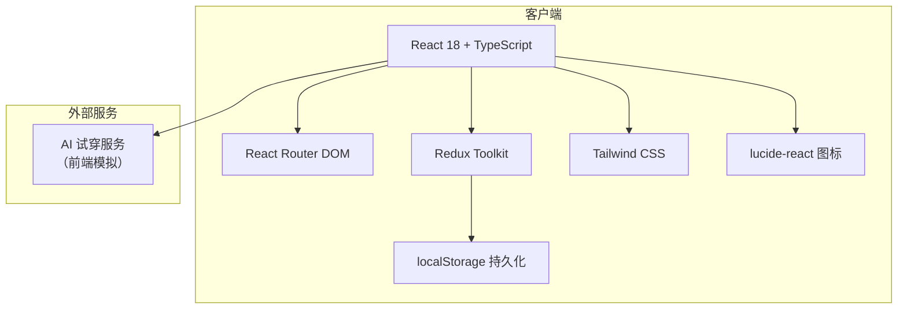
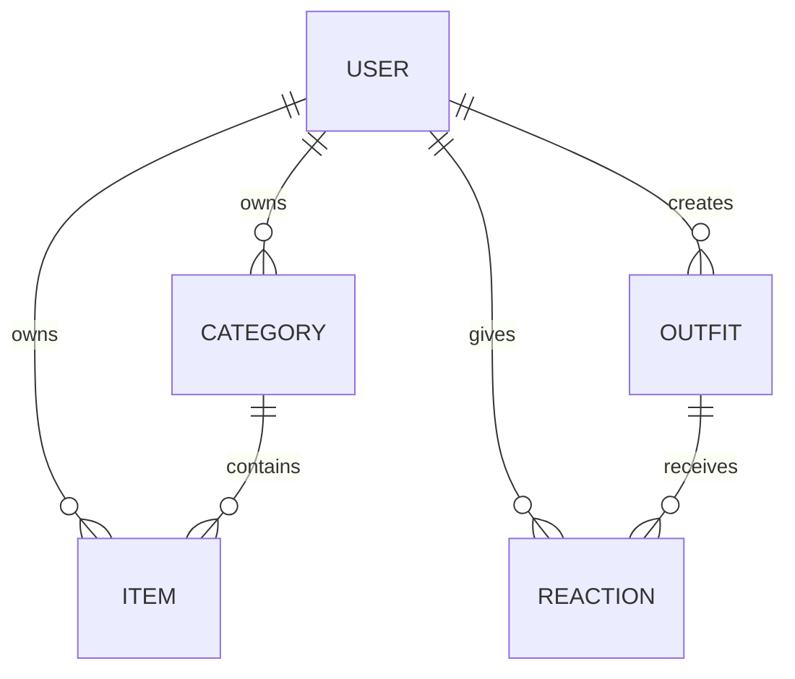

# 技术架构文档：衣橱搭配助手 ClosetMate

## 1. 架构设计



## 2. 技术选型

- **前端框架**：React 18
- **开发语言**：TypeScript
- **构建工具**：Vite
- **状态管理**：Redux Toolkit（替代模板默认的 zustand，满足用户指定技术栈）
- **路由**：React Router DOM
- **样式方案**：Tailwind CSS
- **图标库**：lucide-react
- **存储**：localStorage（纯前端演示，无需后端）
- **模拟 AI 服务**：前端 setTimeout + 占位图生成

## 3. 项目初始化

使用 `vite-init` 模板 `react-ts` 创建项目，随后替换状态管理为 Redux Toolkit。

```bash
npm init vite-init@latest -y . -- --template react-ts --force
```

安装额外依赖：

```bash
npm install @reduxjs/toolkit react-redux react-router-dom
```

## 4. 路由定义

| 路由 | 用途 | 访问控制 |
| :--- | :--- | :--- |
| `/login` | 登录页 | 未登录 |
| `/register` | 注册页 | 未登录 |
| `/items` | 物品主页（分类卡片流） | 需登录 |
| `/categories/manage` | 分类管理页 | 需登录 |
| `/categories/:categoryId` | 分类详情页 | 需登录 |
| `/outfits` | 搭配选择页 | 需登录 |
| `/outfits/result` | 搭配结果页 | 需登录 |
| `/profile` | 个人中心页 | 需登录 |
| `/profile/reactions/:type` | 互动记录页 | 需登录 |
| `/profile/edit` | 编辑资料页 | 需登录 |

## 5. 数据模型

### 5.1 TypeScript 类型定义

```typescript
export type Gender = 'MALE' | 'FEMALE';
export type Theme = 'PINK' | 'GRAY';
export type ReactionType = 'LIKE' | 'FAVORITE' | 'DISLIKE';

export interface User {
  userId: string;
  avatar?: string;
  nickname: string;
  password: string; // 前端做简单哈希存储
  gender: Gender;
  phone?: string;
  email?: string;
}

export interface Category {
  categoryId: string;
  userId: string;
  name: string;
  isDefault: boolean;
}

export interface Item {
  itemId: string;
  categoryId: string;
  userId: string;
  imageUrl: string;
  name: string;
  createTime: string;
  price?: number;
}

export interface Outfit {
  outfitId: string;
  userId: string;
  items: string[];
  resultImageUrl?: string;
  createTime: string;
}

export interface Reaction {
  reactionId: string;
  userId: string;
  outfitId: string;
  type: ReactionType;
}
```

### 5.2 实体关系



## 6. 核心业务规则

1. 同一用户下分类名称不可重复。
2. 每个物品必须且只能属于一个分类。
3. 搭配流程中每个分类仅允许单选物品，再次点击同分类其他物品会替换已选。
4. 开始试穿必须同时选中“上装”、“下装”、“鞋子”三个分类的物品。
5. 同一用户对同一搭配仅保留一种反应，新反应覆盖旧反应。

## 7. 存储与持久化

- Redux store 初始化时从 `localStorage` 读取 `closetmate_state`。
- 每次 reducer 更新后，将用户相关 slice 序列化写入 `localStorage`。
- 持久化字段包括：`users`、`currentUserId`、`categories`、`items`、`outfits`、`reactions`、`theme`。
